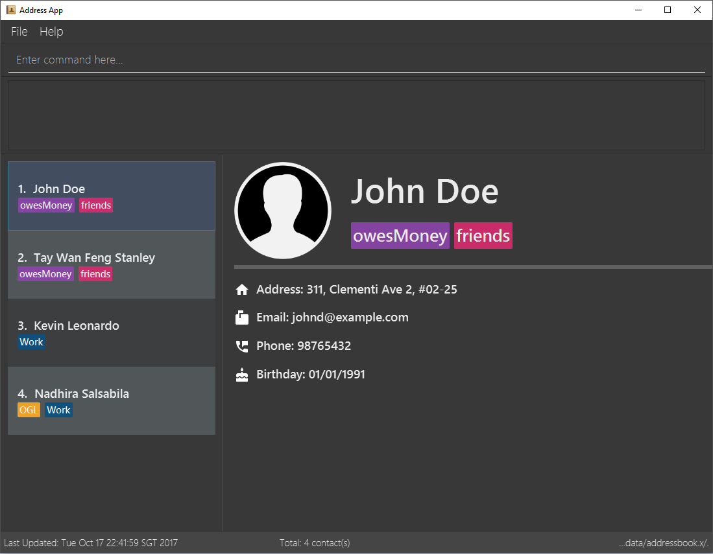

= K.N.S. AddressBook v1.5.0
ifdef::env-github,env-browser[:relfileprefix: docs/]
ifdef::env-github,env-browser[:outfilesuffix: .adoc]

https://travis-ci.org/CS2103AUG2017-W11-B3/main[image:https://travis-ci.org/CS2103AUG2017-W11-B3/main.svg?branch=master[Build Status]]
https://ci.appveyor.com/project/k-l-a/main[image:https://ci.appveyor.com/api/projects/status/rtvl6n00jsm1ad4a/branch/master?svg=true[Build status]]
https://coveralls.io/github/CS2103AUG2017-W11-B3/main?branch=master[image:https://coveralls.io/repos/github/CS2103AUG2017-W11-B3/main/badge.svg?branch=master[Coverage Status]]

ifdef::env-github[]

endif::[]

ifndef::env-github[]
image::images/Ui.png[width="681"]
endif::[]

K.N.S. AddressBook is a free Java desktop application available on Windows and Mac OS X operating systems. It is
designed for freelancers who are bound to their desks, making many calls to clients with their work phone.

Oftentimes, freelancers have one hand on the phone, and their other hand can't possibly use both the keyboard and mouse at the same time! Thus, most of the interactions with the application are done through an in-built Command Line Interface (CLI), which allows
you do add, edit and remove contacts quickly with only the use of a keyboard.

Even if you aren't a freelancer, you're always welcome to try out our application!

== Site Map

* <<UserGuide#, User Guide>>
* <<DeveloperGuide#, Developer Guide>>
* <<AboutUs#, About Us>>
* <<ContactUs#, Contact Us>>

== Acknowledgements

* Original source code was taken from the https://github.com/nus-cs2103-AY1718S1/addressbook-level4/[AddressBook-Level4 project], which was created by the https://github.com/se-edu[SE-EDU initiative].

* Backgrounds and Icons used in the Person Panel were made by https://lukemcdonald.com/[Luke McDonald] and http://www.paomedia.com/[Arnaud Chesne] respectively.

== Licence : link:LICENSE[MIT]
